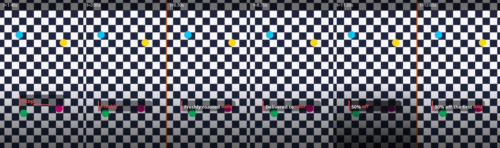
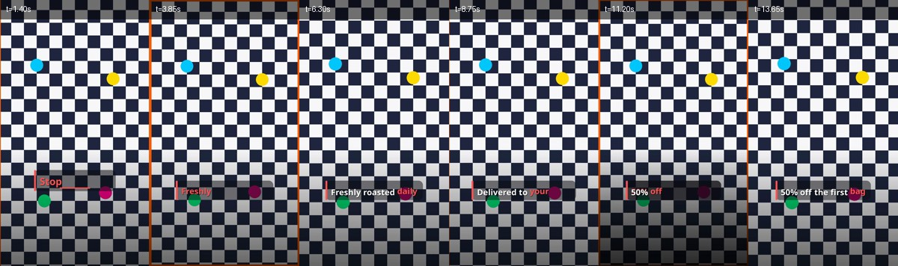
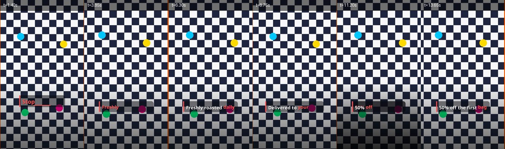

# 4-2 Camera motion — verification

Reproduce with:

```bash
cd backend
.venv/bin/python verify_motion.py --ratios 9:16 --intensities weak,medium
.venv/bin/python verify_motion.py --ratios 1:1,16:9 --motions zoom_in,pan_left --intensities weak,medium
.venv/bin/python verify_motion.py --ratios 9:16 --motions pan_left,zoom_in,auto \
    --sheets pan_left,zoom_in,auto --pattern --intensities weak
.venv/bin/python verify_motion_override.py
.venv/bin/python verify_motion_video.py
```

## What is checked

| check | how |
|---|---|
| black edge | worst fraction of any outer row/column at or below luma 8, at full resolution. Sampled across the finished video **and** at the last frame of every scene, which is where a pan has spent all of its margin and a black band would appear first |
| jitter | mean per-frame change over 1s inside a single scene, plus the smallest change relative to that mean. Measured only on the top 45% of the frame, which carries no caption |
| caption err | largest gap between a scene's start and where its narration lands |

Two things had to be fixed before the numbers meant anything:

- **The metric measured the captions, not the camera.** The first run flagged all
  eight motions — including `none`, which does not move at all. The window spanned
  scene cuts and included the pop-caption band, so it was reading text animating in.
  Scoped to one scene and to the caption-free top of the frame, `none` now reads
  exactly `0.0, 1.0`, which is what makes it a usable control.
- **The gradient background hides motion.** The shipped gradient provider paints a
  vignette, so a subtle pan across it changes almost no pixels and a black edge
  would blend into an already-dark border. `--pattern` renders on a high-contrast
  grid that runs to all four edges instead; the same motion moves 50-100x more
  signal there, so smoothness is judged on those runs. On gradient runs the
  smoothness column is reported as `n/a` below a noise floor rather than guessed at.

## Results

All 27 renders pass: no black edges in any ratio, no stalled frames, caption
offset 0.000s everywhere.

| motion | 9:16 | 1:1 | 16:9 |
|---|---|---|---|
| none (control) | pass — 0.0 movement | — | — |
| zoom_in / zoom_out | pass | zoom_in pass | zoom_in pass |
| pan_left / right / up / down | pass | pan_left pass | pan_left pass |
| auto | pass | — | — |

Per-scene override (`verify_motion_override.py`), one render, project default `none`:

| scene | movement | smoothness |
|---|---|---|
| pan_left, strong | 5.21 | 0.88 |
| pan_left, weak | 1.77 | 0.68 |
| inherits default (none) | 0.0 | 1.0 |

## Footage, not just stills

Stills and footage take different branches: a still is moved with `zoompan`,
footage with a `crop` window sliding across an enlarged frame, because `zoompan`
restarts on every input frame. The stills matrix says nothing about the other
branch, so `verify_motion_video.py` covers it on a synthesised high-contrast clip
(offline, no Pexels key needed).

| motion | footage clips used | length (expected 6.0s) | black edge |
|---|---|---|---|
| pan_left | 2 | 6.000s | none |
| pan_down | 2 | 6.000s | none |
| zoom_in | 2 | 6.000s | none |

It also asserts that footage quietly caps movement at the lightest strength even
when the project asks for `strong`, and that the cap is a real restriction rather
than intensity being ignored everywhere.

Footage uses a 2x canvas rather than the stills' 4x: a still is enlarged once per
scene, but footage pays that cost on every frame, and moving footage leaves the
coarser sub-pixel grid nothing to show against.

## The judder bug this caught

A subtle pan crosses ~0.4 output pixels per frame. `zoompan` rounds its crop
offset to whole pixels of the upscaled canvas, and at the original `UPSCALE = 2`
that grid is 0.5px — coarser than the step — so the picture froze for a frame and
then jumped ~2px:

Per-frame change on the same weak pan, same clip, same 1s window — the near-zero
entries are the frozen frames:

```
UPSCALE=2:  2.61, 0.05, 2.50, 2.49, 0.11, 2.61, 2.59, 0.05, 2.52
UPSCALE=4:  2.54, 1.37, 2.60, 1.20, 1.27, 2.51, 1.29, 1.36, 2.54
```

Zooms were never affected: their `z` changes continuously, so every frame is
resampled. `UPSCALE = 4` puts the grid at 0.25px and the movement lands somewhere
new every frame — smoothness on a weak pan went 0.19 → 0.68 for about 30% more
render time on a 3-scene clip.

Only `medium` was exercised at first, which is why this was nearly missed: the
bug only shows at the slowest movement. The matrix now covers `weak` as well, and
`verify_motion_override.py` holds every moving scene to the smoothness bar.

## Contact sheets

Rendered on the verification grid so the movement is actually visible, at `weak`
(the strength that used to judder). Content reaches all four frame edges in every
frame — no black borders.

| | |
|---|---|
| `pan_left` |  |
| `zoom_in` |  |
| `auto` |  |
