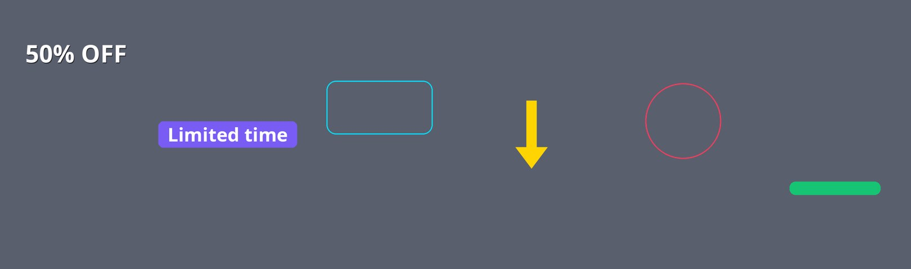
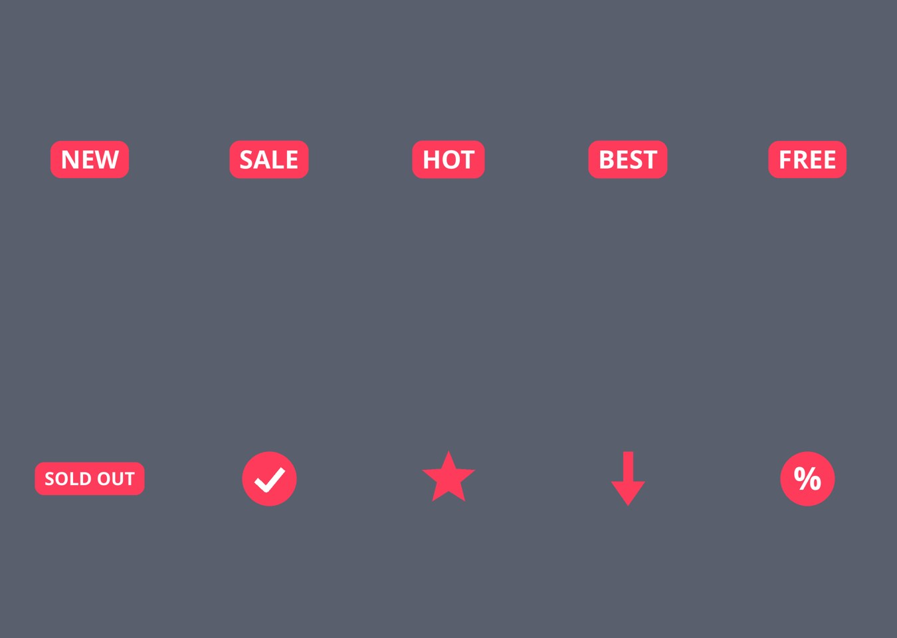
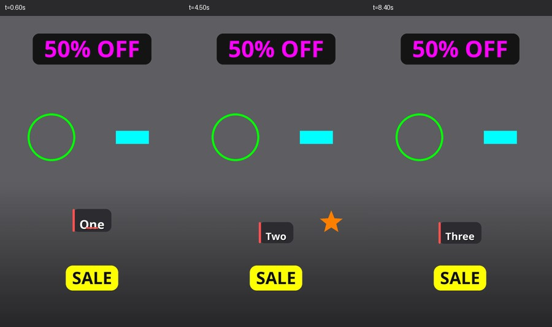
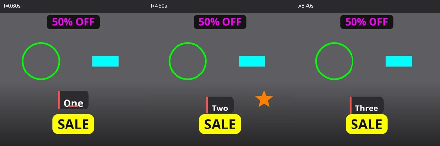
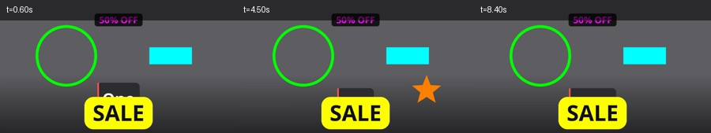

# 4-3 Graphic overlays — verification

Reproduce with:

```bash
cd backend
.venv/bin/python verify_overlays.py --sheets   # renders 3 ratios and measures them
.venv/bin/python verify_overlays.py --sampler  # draws every kind + sticker, no video
```

## What is checked

Every overlay is drawn in a colour nothing else in the frame uses, so it can be
found again in the rendered pixels. That turns the claims into measurements:

| check | how |
|---|---|
| present | each kind is located by its marker colour; fewer than 40 matching pixels counts as missing |
| consistent | positions are percentages, so the centroid of each marker — as a fraction of width/height — must agree across 9:16, 1:1 and 16:9 to within 3% |
| timed | an overlay pinned to one scene must be absent from the others |
| faded | an arriving overlay is still mostly transparent 0.04s in, and fully up by 0.6s |
| no blink | an overlay spanning the whole video must NOT fade again at each scene boundary it crosses |

Renders use hard cuts and no camera motion, so overlay placement is the only
thing that can move, and a mismatch cannot be blamed on something else.

## Results

All four kinds plus scene pinning, in all three ratios:

| overlay | 9:16 | 1:1 | 16:9 | position spread |
|---|---|---|---|---|
| text | 48.9%, 14.8% | 49.3%, 14.8% | 49.6%, 14.8% | x 0.6%, y 0.0% |
| shape | 27.9%, 41.9% | 27.9%, 41.9% | 27.9%, 41.9% | x 0.1%, y 0.0% |
| logo | 71.9%, 41.9% | 71.9%, 41.9% | 71.9%, 41.9% | x 0.1%, y 0.1% |
| sticker | 50.0%, 85.0% | 50.0%, 85.0% | 50.0%, 84.9% | x 0.0%, y 0.1% |
| scene-pinned | 79.8%, 68.0% | 79.9%, 68.0% | 79.8%, 67.9% | x 0.1%, y 0.1% |

Timing, per ratio:

| ratio | pinned graphic outside its scene | arriving: 0.04s in → 0.6s | whole-video graphic across a boundary |
|---|---|---|---|
| 9:16 | 7 px | 6 px → 1554 px | 8839 px (no blink) |
| 1:1 | 4 px | 2 px → 1537 px | 8839 px (no blink) |
| 16:9 | 19 px | 19 px → 4874 px | 28702 px (no blink) |

The handful of stray pixels is antialiasing on a neighbouring graphic's edge,
an order of magnitude below the 40px threshold.

## Two things the measurements caught

- **The background was failing the test, not the overlays.** The first run
  reported the scene-pinned graphic leaking into every scene — 28,273 stray
  pixels. The gradient provider picks a colour per scene, and one of them was an
  orange-brown close enough to the marker to be counted as the overlay. Overlays
  are what this file tests, so it now renders them on a flat mid-grey background
  and the same measurement reports 3-19 px.
- **A circle highlight was not a circle.** Width and height are percentages of
  *different* sides of the frame, so honouring both squashed the circle into a
  flat ellipse in 16:9 and stretched it in 9:16 — the same setting did not look
  like the same graphic. A circle now takes one diameter from `width_pct`, and
  `height_pct` is hidden for it in the UI. `label_box` remains for deliberately
  oval framing.

## Every kind, and all ten stickers

Drawn in code with PIL — nothing is fetched, so nothing is licensed.



Text (plain and on a background box), label box, arrow (rotated), circle
highlight, highlight bar.



NEW, SALE, HOT, BEST, FREE, SOLD OUT, check, star, down arrow, percent.

## The same overlays in all three ratios

Frames at 0.6s, mid-video, and near the end. The orange star is pinned to the
middle scene and appears only in the middle frame.

| ratio | |
|---|---|
| 9:16 |  |
| 1:1 |  |
| 16:9 |  |
